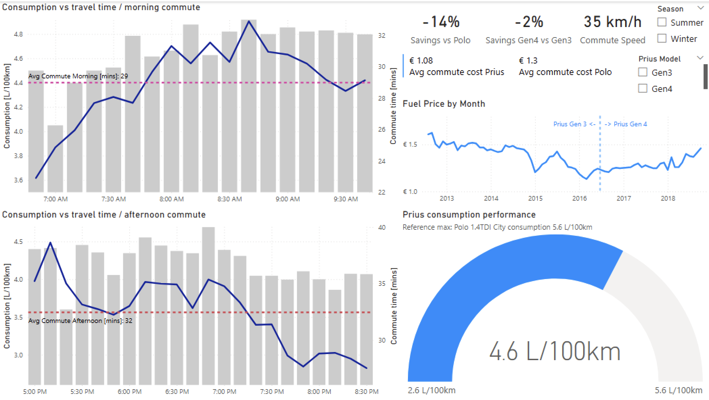

# Paolo Vasta's Data analysis portfolio

Data analyst with an engineering and B2B product-marketing background, focused on extracting practical insights from real-world datasets using Python, Excel, and Power BI.

This portfolio showcases end-to-end analytical work: data preparation, exploration, visualization, and insight generation.

  

---

## 📌 Table of Contents
- [About Me]([#%E2%80%8D-about-me)
- [Interests](#-interests)
- [Featured Projects](#-featured-projects)
- [Tools & Technologies]([#%EF%B8%8F-tools--technologies)
- [Focus Areas](#-focus-areas)
- [Contact](#-contact)
- [License](#-license)

---
## 👨🏻‍💻 About Me

I bring an engineering mindset to data analysis, with a strong focus on structure, measurement, and decision support.
My background in B2B product marketing informs how I frame questions, interpret results, and communicate insights to non-technical stakeholders.

---

## 🔬 Interests

Primary focus:
- Data analysis with Python (pandas, numpy, matplotlib)
- Business analysis and visualization with Excel and Power BI
- Structured problem-solving applied to real-world datasets

Supporting tools and environments:
- SQL (foundations)
- Swift & Xcode (iOS prototyping), Visual Studio (Python scripting)
- GitHub, Jira
- macOS, Linux, Windows

             

---

## 📊 Featured Projects

- [**📊 Hybrid Vehicle Fuel Efficiency Study**](https://github.com/pakitt/data-analysis-portfolio/tree/main/fueltracking)

  **Goal:**
  Evaluate real-world fuel consumption data to determine whether hybrid ownership delivers measurable cost savings and to identify the most efficient commuting route.
 
  **Key insight:**
  Hybrid usage reduced fuel costs by approximately **15% on average**, with consistent savings across different commuting routes.
  
  **Tools:**
  Excel, Power BI
  
  **Explore:**
  1) [Power BI Desktop file](https://github.com/pakitt/data-analysis-portfolio/blob/main/fueltracking/Fuel%20consumption%20tracking.pbix)
  2) Sample visualization:
 

  

-  ### 🚗 iOS App for EV Data and Cost Estimation

Swift-based prototype for estimating EV charging costs and comparing efficiency metrics using user-input and consumption data.

---

## ⚙️ Tools & Technologies

| Area | Tools |
|-------|--------|
| **Data Analysis** | Python (pandas, numpy, matplotlib), Excel |
| **Visualization** | Excel charts, Matplotlib, Power BI |
| **Data Handling** | CSV, XLSX, SQL basics |
| **Development** | Swift & Xcode, GitHub |

---

## 💡 Focus Areas

- Translating complex technical data into actionable insights  
- Understanding user behavior and performance metrics  
- Evaluating ROI and efficiency using real-world data  
- Applying structured, engineering-driven analytical thinking  

---

## 📫 Contact

I am open to data analyst and analytics roles, particularly where technology and business insight intersect.

- [LinkedIn](https://www.linkedin.com/in/paolovasta): https://www.linkedin.com/in/paolovasta
- [Email](mailto:pvjsie@icloud.com): pvjsie@icloud.com
- [CV](https://github.com/pakitt/data-analysis-portfolio/blob/main/assets/Paolo%20Vasta%20-%20CV%20-%20Data%20Analyst%20-%2012-2025.pdf?raw=1)

---

## 🪪 License

© 2025 Paolo Vasta. All rights reserved.  

The content of this repository is made publicly available for **viewing and educational reference only**.  
**No reuse, modification, or redistribution** of any part of this repository is permitted without explicit written permission from the author.
