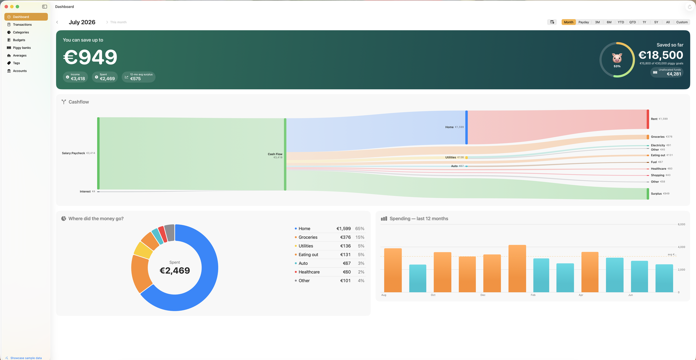
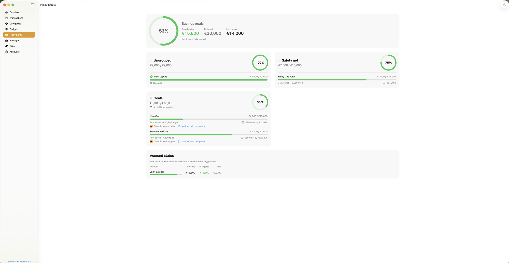
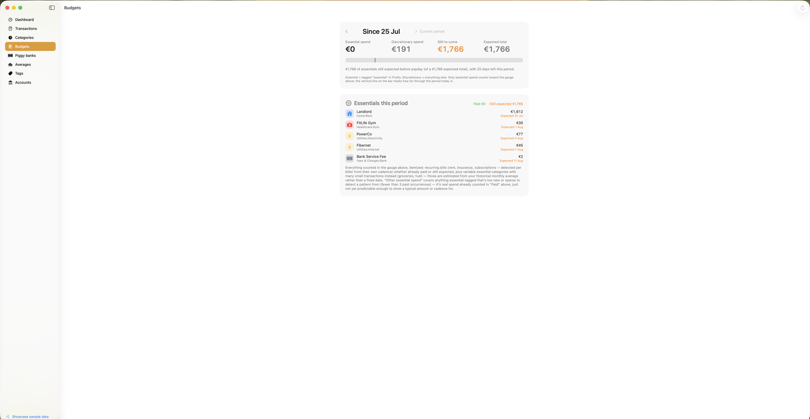

# FireflyDash

A native macOS dashboard for [Firefly III](https://www.firefly-iii.org/), the self-hosted personal finance manager. FireflyDash is read-only by design: Firefly stays the system of record for imports, rules, and tagging, while this app turns that data into a fast, at-a-glance view of pay-period cash flow, essential bills, and savings goals — on the Dashboard, in the menu bar, and in a zero-JavaScript HTML export for iPhone.

Built solo, end to end, over several weeks of active use against a real, multi-year financial dataset.


*Dashboard — pay-period cash flow, savings, and a Sankey breakdown of where money went. All figures shown are synthetic sample data.*

<p float="left">
  
  
</p>
*Piggy Banks (savings goals, day-precise pacing) and Budgets (itemized essentials for the current pay period).*

## Why this exists

Firefly III's own web UI is powerful but calendar-month-centric and not built for a glanceable "what can I safely spend right now" answer. FireflyDash reframes the same synced data around the **pay period** instead: since my last paycheck, how much of what's left is already spoken for — essential bills still due, savings goals still owed their share this period, money already parked for something else — and what's genuinely free.

## Highlights

A few of the more interesting engineering problems this project involved:

- **Correct progress tracking for irregular contributions.** An early version recomputed "how much of this savings goal is still owed this period" fresh on every render, as a live share of the remaining balance. That formula barely moved even *immediately after paying a goal in full*, because it was re-deriving a share of an already-reduced balance rather than tracking a paid/unpaid ledger. The fix: freeze a `(target, baseline)` pair per goal at the start of each pay period, and track progress as a portfolio delta against that frozen snapshot — the only design that reaches exactly zero once a goal's share is actually paid, in any split, across any number of contributions.
- **Background sync that survives real data volume.** A full-history fetch/parse/upsert against years of real transactions ran fine against the small bundled demo dataset but noticeably blocked the UI against the real thing. Sync was moved onto a `@ModelActor` background actor (Apple's WWDC23-recommended SwiftData pattern), with the main actor left to just await results and update status text.
- **Self-correcting bill detection.** Recurring essential bills are auto-detected from tagged transactions and their typical amount/cadence is estimated from a median of recent payments. Windowing that median by a fixed *time span* meant a genuine price change (a new energy tariff, a renewed insurance policy) took months to be reflected, since the new price had to outnumber a year of the old one. Switching to a median over the last *N occurrences* instead makes the estimate self-correct within a handful of payments — verified against a real mid-year insurance repricing.
- **A real Dynamic-Type-style scaling system.** macOS has no built-in Dynamic Type hook for third-party apps, so text scaling across the whole app (window-width-driven, ~1.0×–1.5×) is implemented as genuine point-size relayout via a custom environment value and font modifier — not a blurry `.scaleEffect`.
- **A dual dataset architecture for safe demos.** Every dataset-scoped setting (which accounts count as savings, which categories are excluded, which tag marks a bill "essential," etc.) is stored as a real/sample pair selected by a single toggle, so the entire app — Dashboard, Budgets, menu bar, HTML export — can run against a deterministic ~3-year synthetic dataset through the exact same code paths as the real synced data, with zero risk of the two ever mixing. (This build defaults to that sample dataset — see **Running it**, below.)
- **A zero-JavaScript HTML export.** The iPhone-facing export has to render inside iOS Quick Look, which doesn't execute JS, so every range/view combination is pre-rendered server-side into one self-contained HTML file, with switching handled entirely by CSS (`<input type="radio">` + sibling `:checked` selectors).

## Feature tour

- **Dashboard** — pay-period cash flow, a projected safe-to-spend figure, unallocated funds, cashflow flow chart, category breakdown, spend trend.
- **Budgets** — an itemized list of every essential expected this period (recurring bills *and* variable categories like groceries), reconciled against actual spend so the numbers always add up; a savings-goals-as-essentials line for goals funded toward irregular bills like annual insurance.
- **Piggy Banks** — every Firefly savings goal, grouped, with day-precise pacing (not Firefly's own often-unreliable per-month figure), a "mark as paid this period" override, and per-account balance/allocated/free breakdown.
- **Categories / Averages / Transactions / Tags** — drill-down views for spend by category, historical monthly averages, a corrected income/expense/transfer split (transfers between your own accounts are never counted as income), and an all-time per-tag summary.
- **Menu bar widget** — the same pay-period numbers, always one click away.
- **iPhone export** — a self-contained HTML snapshot written to iCloud Drive, viewable offline via Quick Look.

## Tech stack

Swift 6 · SwiftUI · SwiftData · Swift Charts · macOS 26 (Tahoe) · REST sync against the [Firefly III API](https://api-docs.firefly-iii.org/).

## Architecture, in brief

```
FireflyDash/
├── Models/          SwiftData @Model types mirroring Firefly's transactions, accounts, piggy banks
├── Sync/             Background-actor REST sync engine (FireflyAPI, SyncActor, SyncEngine)
├── Support/          Cross-cutting logic: bill/essentials projection (Insights), savings-goal
│                      progress tracking (PiggyProgress), dataset scoping (AppSettings), the
│                      synthetic demo dataset generator (SampleData), adaptive font scaling,
│                      HTML export, Keychain-backed token storage
└── Views/            One SwiftUI view per section (Dashboard, Budgets, Piggy Banks, Categories,
                       Averages, Transactions, Tags, Settings, menu bar)
```

Shared computation (essentials projection, savings-goal commitment) lives in `Support/` and is called identically from the Dashboard, the menu bar, and the HTML export, so all three surfaces are always in agreement — an earlier version had each recompute independently and could silently drift out of sync.

## Running it

This build launches straight into the bundled sample dataset by default — no Firefly III server required. Open `FireflyDash.xcodeproj` in Xcode 26+ on macOS 26 (Tahoe) or later, build and run, and you'll land on a fully populated dashboard backed by ~3 years of deterministic synthetic transactions across realistic categories, merchants, and savings goals. (To point it at a real Firefly III instance instead, add a server URL and access token in Settings and switch off "Use sample data.")

## Privacy & data

FireflyDash never writes to Firefly — all mutations (adding money to a goal, editing a transaction) happen in Firefly's own UI; this app only reads. The access token is stored in the Keychain behind Touch ID and is never logged, exported, or transmitted anywhere but the user's own Firefly III server. The dataset shipped with this repository is entirely synthetic, generated from a fixed seed — it contains no real financial data.

---

Built by Paolo as a personal tool, cleaned up and open-sourced as a portfolio piece.
